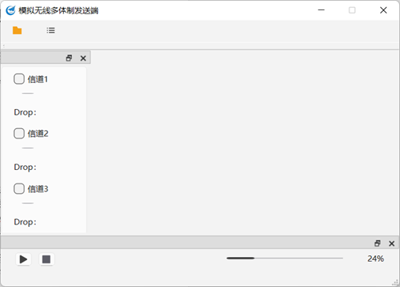

# 

# 多路融合传输协议模拟系统

为模拟现实环境下的多体制遥测链路，初步验证所设计协议的核心机制（多路、FEC、包结构）的可行性。本模拟系统的核心目标是：

1.提供一个可测试的平台，用于在模拟环境下评估协议特性和性能。

2.模拟系统当前主要实现的协议的逻辑。

## 一、系统架构

  模拟系统发送端采用基于 Qt 的 GUI + 后端逻辑分离的设计，由`Gui`、`Udpserver`和FEC模块组成。

 ` Channel_sim` (前端/控制层):继承自 QMainWindow，负责用户界面的展示和交互。使用 Qt Designer 生成的 `ui_Channel_sim.h `来定义界面元素。通过信号和槽机制与 `Udpserver `进行通信。实例化并持有一个 `Udpserver `对象。捕获用户的操作（文件选择、勾选复选框、拖动滑块、点击按钮），并将这些事件转化为对 `Udpserver `的调用或信号发射。

  后端核心类是` Udpserver`，负责核心的业务逻辑，它管理多个 UDP 套接字（通道），并协调文件读取、FEC 编码和数据发送过程。包含一个文件读取线程和多个（每个通道一个）套接字工作线程。

  接收端核心类是`IntegratedDataManager`，实现多个通道的配置和接收，并将接收的数据包进行fec解码，呈递给后续的视频解码和播放模块。

## 二、功能实现

### 1. GUI:负责用户命令参数的传入，实现与程序的交互



主要内容：

| 控件    | 类型          | 功能                  |
|:-----:|:-----------:|:-------------------:|
| 信道开关  | QCheckBox   | 控制信道的开闭（默认为关闭状态）    |
| 丢包率滑块 | QScrollBar  | 调整对应信道丢包率大小（0~100%） |
| 文件按钮  | QAction     | 呼出输入文件窗体            |
| 开始按钮  | QPushButton | 控制发送开始              |
| 窗口按钮  | QAction     | 呼出GUI各子窗口           |

用户在此可以自由控制信道的开闭，设置对应信道的丢包率，输入需要发送的Ts文件。

### 2. 通道状态管理

发送端需要同时维护3个信道，随时对用户的输入参数进行响应，是通过通道上下文`ChannelContext`实现的。

`ChannelContext`的结构:

```cpp
struct ChannelContext {
    std::deque<SendPacket> packetQueue;  // 独立队列存储 SendPacket 对象
    QMutex queueMutex;                   //队列锁
    QWaitCondition queueCondition;       //队列条件变量

    QMutex stateMutex;                   //通道状态锁
    std::atomic<int> enabled{ 0 };       //通道状态标志
    std::atomic<double> lossRate{ 0.0 }; //通道的丢包率
    QWaitCondition stateCondition;       //通道状态条件变量
};
```

通过队列锁和通道锁，能应对多线程场景下对通道状态和通道队列的同步访问。用户每次选择通道时获取最新状态快照，系统能迅速响应通道状态变化。

通道状态的维护是在`channelStateChange`函数中实现的，获取Gui输入的通道状态，修改对应通道状态标志原子变量`enabled`，当通道从禁用变为启用时，访问通道锁并通过条件变量通知对应的工作线程开始发送数据。

在发送线程中，首先访问通道队列锁，获取本轮工作发送的数据，如队列中无数据或通道禁用则会等待，完成数据包的序列化后将数据发送出去。

发送端只在有效通道间顺序轮询，保证了数据片段的连续性和完整性。

### 3.接收端同步接收

设计用于通过 UDP 组播方式，可靠地接收并处理多路并发的数据流，同时利用前向纠错（FEC）技术来恢复可能丢失的数据包。

1. **初始化：** 在创建 IntegratedDataManager 对象时，它首先会初始化 Windows Sockets (Winsock) 网络环境。如果 Winsock 初始化失败，管理器将无法运行。

2. **启动管理器 (startManager)：**
   
   - **创建套接字池：** 管理器根据配置的基础端口号 (m_basePort) 和套接字池大小 (SOCKETS_POOL_SIZE)，创建多个 UDP 套接字。每个套接字绑定到 m_basePort + i（其中 i 是从 0 到 SOCKETS_POOL_SIZE - 1 的索引）端口，并加入指定的组播地址 (m_multicastGroup)。套接字被设置为允许地址重用，并尝试增大接收缓冲区。
   
   - **启动接收线程：** 为池中的每一个套接字，启动一个独立的接收线程 (receiveTask)。每个接收线程专门负责监听其对应的 UDP 端口，接收数据包。
   
   - **启动处理线程：** 启动一个单独的处理线程 (processTask)，负责后续的数据包处理。

3. **数据接收 (receiveTask 线程)：**
   
   - 每个接收线程在其分配的套接字上循环等待接收 UDP 数据报。
   
   - 收到数据后，检查数据包大小是否符合预期 (SendPacket 结构的大小)。
   
   - 验证数据包内部记录的 channel_index 是否与当前接收线程负责的套接字索引一致。如果不一致，则丢弃该数据包（防止数据错乱）。
   
   - 如果数据包有效，将其放入对应通道的线程安全队列 (`m_packetQueue[socketIndex]`) 中。

4. **数据处理 (processTask 线程)：**
   
   - 处理线程以轮询的方式，持续检查所有的通道队列 (m_packetQueue)。
   
   - 当从某个队列中成功取出一个数据包 (SendPacket) 时，调用 handlePacket 方法。
   
   - handlePacket 方法将数据包中的视频/数据部分 (packet.video) 提交给内部的 FEC 解码器 (fec.Recv_PacketByFEC)。
   
   - FEC 解码器根据收到的数据包（可能是原始数据包或冗余校验包）进行解码。如果成功恢复出一个或多个完整的数据帧/块，这些恢复后的数据会暂存在 fec.recv_data_list 中。
   
   - handlePacket 检查 `fec.recv_data_list` 是否有可用的已恢复数据。如果有，就取出数据，封装成 QByteArray。
   
   - **发出数据：** 通过 dataSubmit 信号将恢复好的数据 QByteArray 发送出去，供应用程序的其他部分（如播放器、存储模块等）使用。
   
   - 为了避免 CPU 空转，当处理线程在一轮完整的队列检查中没有处理任何数据包时，它会短暂休眠（例如1毫秒）。

5. **停止管理器 (stopManager)：**
   
   - 设置运行标志 m_isRunning 为 false，通知所有线程停止工作。
   
   - 关闭所有打开的 UDP 套接字。这通常会中断正在 recvfrom 中阻塞的接收线程。
   
   - 等待所有接收线程和处理线程正常结束。如果线程在超时后仍未结束，则可能强制终止。

6. **清理资源：** 在 IntegratedDataManager 对象销毁时（析构函数），如果管理器仍在运行，则先调用 stopManager。最后，如果 Winsock 之前已成功初始化，则调用 WSACleanup 清理 Winsock 环境。

多个接收线程独立接收各自socket的数据，验证后放入对应的无锁队列。

处理线程轮询所有队列，依次尝试取出数据包进行处理。

处理线程在没有数据时短暂休眠，避免CPU占用过高。

停止时，通过原子变量通知所有线程退出，并等待线程结束，清理资源。

### 4.FEC编解，

系统采用FEC技术对传输的可靠性提供保障，这主要是在`fec`类中实现的，
